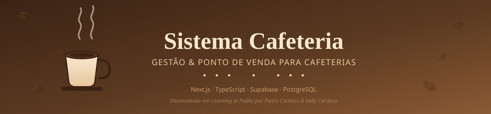

<div align="center">



<br/>


<sub>☕ Sistema completo de gestão e PDV para cafeterias — do grão ao pedido finalizado ☕</sub>

<br/>

[Sobre](#-sobre-o-projeto) • [Arquitetura](#️-arquitetura-a-receita-por-trás-do-café) • [Cardápio Técnico](#️-cardápio-técnico) • [Etapas de Preparo](#️-etapas-de-preparo-roadmap) • [Como Rodar](#-como-servir-este-café-instalação) • [Baristas](#-baristas-autores)

</div>

<br/>

> ☕ **Nota do barista:** este projeto é preparado com carinho e documentado em tempo real — cada commit é um grão a mais na mistura.

---

## 📖 Sobre o Projeto

O **Sistema Cafeteria** é um sistema de gestão ponta a ponta para cafeterias — do cadastro de produtos ao fechamento de pedidos e relatórios de faturamento. Nasceu como laboratório prático de **arquitetura de software**, **modelagem de banco de dados relacional**, **lógica de negócio** e **integração com serviços em nuvem**, mas foi desenhado com padrões e organização de código pensados para produção real.

O desenvolvimento segue a filosofia de **Learning in Public** ☀️ — cada etapa é documentada aqui para que qualquer pessoa acompanhe a evolução em tempo real, do mesmo jeito que se acompanha um espresso sendo tirado.

> 💡 Este é o segundo projeto fullstack de Pietro, após o [**ParkSim**](https://github.com/Pietro2820/ParkSim) (Java + MySQL) — agora explorando uma stack moderna com Next.js e Supabase.

---

## ☕️ Arquitetura (a receita por trás do café)

Assim como um bom café depende de etapas bem definidas — moer, extrair, servir — o sistema segue uma arquitetura em camadas, para que backend e frontend evoluam em paralelo sem pisar um no pé do outro:

<div align="center">

| Camada | Papel na "receita" | Responsabilidade técnica |
|:---:|:---|:---|
| 🫘 `services/` | **Moagem** — prepara a matéria-prima | Acesso a dados: toda comunicação com o Supabase (CRUD, queries, regras de negócio) |
| ⚙️ `hooks/` | **Extração** — transforma em algo consumível | Estado reativo: loading, erros e ponte entre backend e frontend |
| ☕ `app/` + `components/` | **Serviço** — o que chega até a mesa | Interface (UI), consumindo apenas dados já tratados pelos hooks |

</div>

```
Supabase (PostgreSQL)
        ↓
    services/        → 🫘 moagem dos dados
        ↓
     hooks/           → ⚙️ extração (estado, loading, erros)
        ↓
  app/ + components/  → ☕ o café servido (UI)
```

Essa separação mantém a lógica de negócio isolada da interface — facilita testes, manutenção e a divisão de tarefas entre os desenvolvedores.

---

## 🛠️ Cardápio Técnico

<div align="center">

| Item do cardápio | Tecnologia | Por que está na receita |
|:---|:---|:---|
| ☕ **Base** | Next.js (App Router) | SSR, performance e estrutura moderna de rotas |
| 🥛 **Encorpamento** | TypeScript | Tipagem estática para segurança e produtividade |
| 🎨 **Latte art** | CSS Modules | Controle total sobre o layout, sem dependências pesadas |
| 🫘 **Grão selecionado** | Supabase (PostgreSQL) | BaaS completo com Auth, Realtime e Row Level Security |
| 📋 **Ficha técnica** | Git + GitHub | Histórico público e documentado do desenvolvimento |

</div>

---

## 🗺️ Etapas de Preparo (Roadmap)

Do grão cru até o café servido — progresso do projeto por fase, com data de entrega nos itens concluídos.

<details open>
<summary><strong>🌱 Fase 0 — Colheita & Setup</strong> <kbd>concluída</kbd></summary>

- [x] Criar repositório e configurar ambiente local — `29/08/2026`
- [x] Instalar Next.js com TypeScript — `29/08/2026`
- [x] Configurar projeto e cliente Supabase — `29/08/2026`

</details>

<details open>
<summary><strong>🫘 Fase 1 — Blend & Modelagem de Banco de Dados</strong> <kbd>concluída</kbd></summary>

- [x] Criar tabelas de `categorias` e `produtos` (UUID e flag de disponibilidade) — `30/08/2026`
- [x] Criar tabelas de `pedidos` e `itens_pedido` com Foreign Keys — `30/08/2026`
- [x] Configurar ações de Cascade (exclusão de itens) e Restrict (proteção de histórico) — `30/08/2026`

</details>

<details open>
<summary><strong>⚙️ Fase 2 — Extração (Arquitetura de Backend)</strong> <kbd>concluída</kbd></summary>

- [x] Criar camada de services para abstrair chamadas ao Supabase — `30/08/2026`
- [x] Criar custom hooks reativos (`useProdutos`, `usePedidos`, etc.) — `30/08/2026`
- [x] Implementar módulo de Analytics (faturamento diário, ticket médio, top produtos) — `30/08/2026`
- [x] Aplicar regras de negócio (ex.: ignorar pedidos cancelados nos relatórios) — `30/08/2026`

</details>

<details open>
<summary><strong>☕ Fase 3 — Servindo o Café (Frontend & PDV)</strong> <kbd>em andamento</kbd></summary>

- [x] Layout do painel administrativo (dashboard, cardápio, categorias, fila de pedidos) — `31/08/2026`
- [x] Modal de edição de produtos e filtros por categoria — `31/08/2026`
- [x] Status de pedidos com cores dinâmicas — `31/08/2026`
- [ ] Integração real entre frontend e backend
- [ ] Tela do PDV com carrinho de compras
- [ ] Cálculo de total e finalização de pedido

</details>

<details>
<summary><strong>🚀 Fase 4 — Café Pronto para o Cliente (Produção)</strong> <kbd>planejada</kbd></summary>

- [ ] Sistema de login (Supabase Auth)
- [ ] Row Level Security (RLS) para produção
- [ ] Realtime para atualização instantânea da cozinha (KDS)
- [ ] Integração com gateway de pagamento

</details>

---

## 🚀 Como Servir Este Café (Instalação)

**Pré-requisitos:** Node.js 18+ e uma conta [Supabase](https://supabase.com/).

```bash
# 1. Clone o repositório
git clone https://github.com/Pietro2820/Sistema-Cafeteria-.git
cd Sistema-Cafeteria-

# 2. Instale as dependências
npm install

# 3. Configure as variáveis de ambiente
# Crie um arquivo .env.local na raiz com:
# NEXT_PUBLIC_SUPABASE_URL=sua_url_aqui
# NEXT_PUBLIC_SUPABASE_ANON_KEY=sua_chave_aqui

# 4. Inicie o servidor de desenvolvimento
npm run dev
```

Acesse [http://localhost:3000](http://localhost:3000) e sirva-se. 🎉

---

## 🤝 Contribuindo

Este é um projeto de aprendizado aberto — a mesa está posta. Sugestões, issues e pull requests são bem-vindos: sinta-se à vontade para abrir uma *issue* com ideias, dúvidas ou correções.

---

## 👨‍🍳👩‍🍳 Baristas (Autores)

<div align="center">

<table>
<tr>
<td align="center" width="50%">
<strong>Pietro Cardoso</strong><br/>
<sub>Arquitetura de backend, modelagem de dados e lógica de negócio</sub><br/><br/>
<a href="https://github.com/Pietro2820"></a>
<a href="https://www.linkedin.com/in/pietro-cardoso"></a>
</td>
<td align="center" width="50%">
<strong>Kelly Cardoso</strong><br/>
<sub>Desenvolvimento frontend, UX e estilização</sub><br/><br/>
<a href="https://github.com/KellyCardosoB"></a>
<a href="https://www.linkedin.com/in/kellycardosob/"></a>
</td>
</tr>
</table>

</div>

---

<div align="center">

**Desenvolvido com ☕ e código por Pietro Cardoso e Kelly Cardoso**

<sub>🫘 Sem café, sem commits 🫘</sub>

</div>